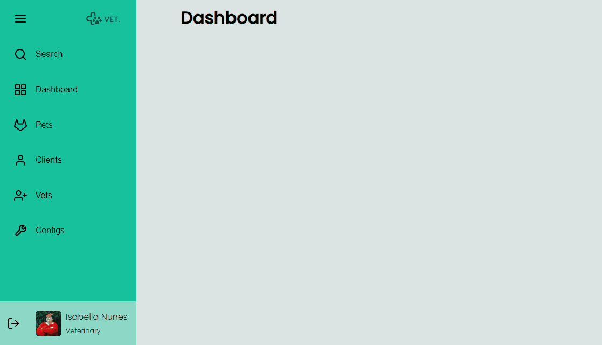

# Sidebar

## About

An animated sidebar.

## Run

Install [Live Server extension](https://marketplace.visualstudio.com/items?itemName=ritwickdey.LiveServer), right click on `index.html` file and then click on `Open with Live Server`.

### Status

Finished 🛑

## License

[MIT](/LICENSE)
